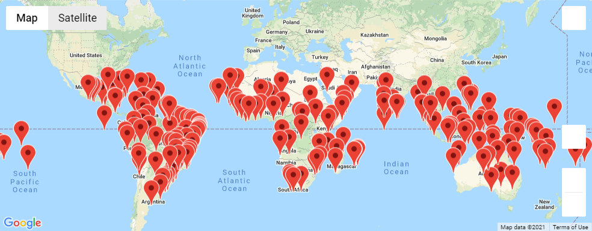

# World_Weather_Analysis

## Overview of Project
- Provide real-time visual suggestions for our client's ideal travel destinations and hotels based on their ideal temperatures. To acomplish this we will use the following tools.
  - Using NumPy to generate 2,000 random latitude/longitude coordinates. 
  - Using the citipy module to list the nearest city to the latitudes and longitudes.
  - Creating and using a OpenWeatherMap API key to request the current weather data from each unique city in your list.
  - Using Pandas and Matplotlib we created scatter plots and determined correlations for the following weather data.
    - Latitude and temperature
    - Latitude and humidity
    - Latitude and cloudiness
    - Latitude and wind speed 
  - Creating and using a Google Maps and Places API key to do the following. 
    - Create heat maps 
    - Find hotels in our ideal temperature cities
    - Add pop-up markers to the heatmap that display city/weather information
    - Select 4 cities that are geographically convenient to eachother and generate a trip route itinerary